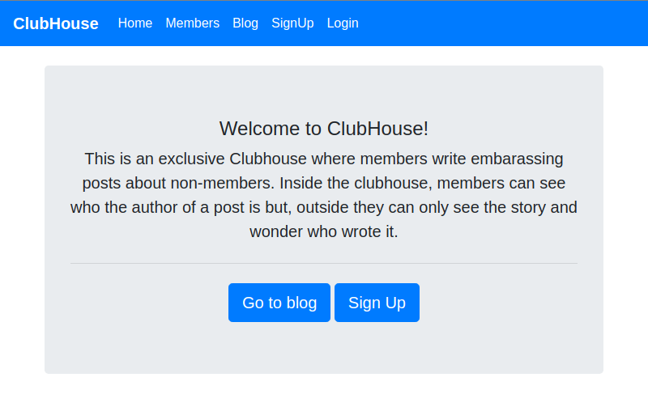

<!-- PROJECT TITLE -->

<h1 align="center">Members Only</h1>


<!-- TABLE OF CONTENTS -->


## Table of Contents

* [About the Project](#about-the-project)
* [Live Preview](#live-preview)
* [Built With](#built-with)
* [Required Installations](#required-installations)
* [Instalation of This App](#instalation)
* [License](#license)
* [Contact](#contact)
* [Acknowledgements](#acknowledgements)


<!-- ABOUT THE PROJECT -->
## About The Project

In this project, you’ll be building an exclusive clubhouse where your members can write embarrassing posts about non-members. Inside the clubhouse, members can see who the author of a post is but, outside, they can only see the story and wonder who wrote it.

Full task description: <a href="https://www.theodinproject.com/courses/ruby-on-rails/lessons/authentication"> Odin Project.</a>

## Live Preview

This is the link to the live preview in Heroku. Feel free to visit.<br>
<a href="https://fierce-meadow-63742.herokuapp.com/">Members-Only ClubHouse</a> <br>
<p>Below is the HomePage Screenshot</p>


## Built With 

* Git
* Ruby
* Ruby on Rails
* HTML
* CSS

## Required Installations

<p>If you want a copy of this project running on your machine you have to install:</p>

* Ruby 2.6.4
* Gem 3.0.3
* Rails 6.0.2
* Bundler 2.0.2

<a href="https://www.tutorialspoint.com/ruby-on-rails/rails-installation"> Installation Instructions</a>

<!-- INSTALATION -->
## Instalation of This App

Once you have installed the requiered packages shown on the [Required Installations](#required-installations), proceed with the following steps

Clone the Repository,

```Shell
your@pc:~$ git clone https://github.com/adaorachi/member_only
```

Move to the downloaded folder

```Shell
your@pc:~$ cd member_only
```

install gems

```Shell
your@pc:~$ bundle install --without production
```

migrate the database

```Shell
your@pc:~$ rails db:migrate
```

Run the app in a local server:

```Shell
your@pc:~$ rails server
```

Then, go to [http://localhost:3000](http://localhost:3000)

<!-- LICENSE -->
## License

Distributed under the MIT License. See `LICENSE` for more information.

<!-- CONTACT -->
## Contact
* Felipe Enne - felipeenne@gmail.com | [Github Account https://github.com/FelipeEnne](https://github.com/FelipeEnne)
* MaryAnn Chukwuka - annychuks07@gmail.com | [Github Account https://github.com/adaorachi](https://github.com/adaorachi)

<!-- ACKNOWLEDGEMENTS -->
## Acknowledgements

* <a href="https://www.microverse.org/"> Microverse</a>  and <a href="https://www.theodinproject.com/"> Odin Project</a> .
